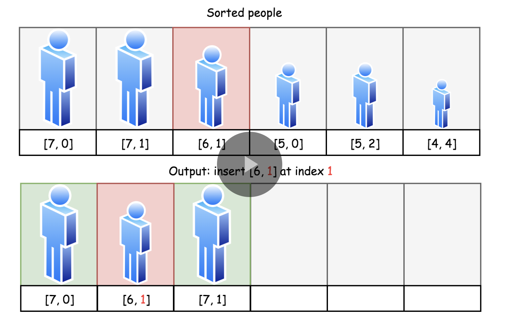

##

https://leetcode.com/problems/queue-reconstruction-by-height/

##

You are given an array of people, people, which are the attributes of some people in a queue (not necessarily in order). Each people`[i] = [hi, ki]` represents the ith person of height `hi` with exactly `ki` other people in front who have a height greater than or equal to hi.

Reconstruct and return the queue that is represented by the input array people. The returned queue should be formatted as an array queue, where `queue[j] = [hj, kj]` is the attributes of the jth person in the queue (`queue[0]` is the person at the front of the queue).

##

Example 1:
```
Input: people = [[7,0],[4,4],[7,1],[5,0],[6,1],[5,2]]
Output: [[5,0],[7,0],[5,2],[6,1],[4,4],[7,1]]
Explanation:
Person 0 has height 5 with no other people taller or the same height in front.
Person 1 has height 7 with no other people taller or the same height in front.
Person 2 has height 5 with two persons taller or the same height in front, which is person 0 and 1.
Person 3 has height 6 with one person taller or the same height in front, which is person 1.
Person 4 has height 4 with four people taller or the same height in front, which are people 0, 1, 2, and 3.
Person 5 has height 7 with one person taller or the same height in front, which is person 1.
Hence [[5,0],[7,0],[5,2],[6,1],[4,4],[7,1]] is the reconstructed queue.
```
Example 2:
```
Input: people = [[6,0],[5,0],[4,0],[3,2],[2,2],[1,4]]
Output: [[4,0],[5,0],[2,2],[3,2],[1,4],[6,0]]
 ```

Constraints:
```
1 <= people.length <= 2000
0 <= hi <= 106
0 <= ki < people.length
It is guaranteed that the queue can be reconstructed.
```

## Approaches I tried but did not work

### Sort by height

### Sort by second num

### Sort by sum of height and second num.

It breaks down in following case:
`[[6,0],[5,0],[4,0],[3,2],[2,2],[1,4]]`
Here `[5,0]` comes before `[4,0]`


## Some observations about relative pair ordering given two pairs

### case: same end `[a, e]` and `[b, e]`, where `a < b`: only possibility is `[[a,e], [b,e]]`

Here only possibility is `...,[b,e],...,[a,e],...`.
e.g. `[2,0]` and `[3,0]`, will only result in `[...,[2,0],...,[3,0],...]`

`Note`: it is not possible to have repeating `[a,e],[a,e]` since it will violate the question

### Case: same start (i.e height), different end, e.g. `[s, c]` and `[s,d]`, and c < d

In this case the only possibility is `...,[s,c],...,[s,d]...`.
Proof is by contradiction, if we try to place `[s,d]` before `[s,c]`, we cannot satisfy final answer.

**This means people of same height can be sorted easily with their increasing count num**

### Case: `[a,b]` and `[c,d]`, where smaller number has lesser cnt i.e a < c and b < d

Here only possible result is `...,[a,b],...,[c,d],...`
e.g. `[5,1] and [6,2]` -> `...,[5,1],...,[6,2],...`

The proof is by contradiction,
if we place `[c,d]` to the left of `[a,b]`, then we would have 'd' items to the left of a which are greater than b. 

### Case: `[a,b]` and `[c,d]`, where smaller number has larger cnt: i.e. a < c and b > d.

This case is the main source of randomness in possible answer.

Here we can have both possibilities:
`...,[a,b],...,[c,d],...`
or
`...[c,d],...,[a,b],...`

e.g.
with `[5,2], [6,1]`
we can have both:
**[5,0],[6,0],`[5,2],[6,1]`**
and
**[6,0],`[6,1],[5,2]`**


## Core Idea

The following strategy could be continued recursively:

1. Sort the tallest guys in the ascending order by k-values and then insert them one by one into output queue at the indexes equal to their k-values. (**comparator logic** - first by decreasing height, and then by increasing k-value )

2. Insertion sort like (according to `k value`) from left to right - Take the next height in the descending order. Sort the guys of that height in the ascending order by k-values and then insert them one by one into output queue at the indexes equal to their k-values.

And so on and so forth.

## Idea image



## Code 

```java
class Solution {
    public int[][] reconstructQueue(int[][] people) {
        // sort by decreasing height , and for same height, increasing k value - this is by case wise analysis.
        Arrays.sort(people, (a,b) -> {
            int heightCompare = Integer.compare(b[0],a[0]);
            if(heightCompare == 0) {
                return Integer.compare(a[1],b[1]);
            }
            return heightCompare;
        });
        
        // for(int i=0;i<people.length;i++) {
        //     System.out.println(Arrays.toString(people[i]));
        // }
        
        List<List<Integer>> ans = new ArrayList<>();
        List<Integer> firstPerson = new ArrayList<>();
        firstPerson.add(people[0][0]);
        firstPerson.add(people[0][1]);
        ans.add(firstPerson);// add first person
        for(int i=1;i<people.length;i++) {
            int[] currentPerson = people[i];
            List<Integer> currPersonList = new ArrayList<>();
            int currHeight = currentPerson[0];
            int currK = currentPerson[1];
            currPersonList.add(currHeight);
            currPersonList.add(currK);

            int j=0;
            while(currK > 0) {
                currK--;
                j++;
            }
            // insert at right position, other elements ar shifted to the right
            ans.add(j, currPersonList);
        }
        
        // System.out.println(ans);
        int[][] ansArray = new int[people.length][2];
        
        for(int i=0;i<people.length;i++) {
            for(int j=0;j<2;j++) {
                ansArray[i][j] = ans.get(i).get(j);
            }
        }
        return ansArray;
            
    }
}
```


