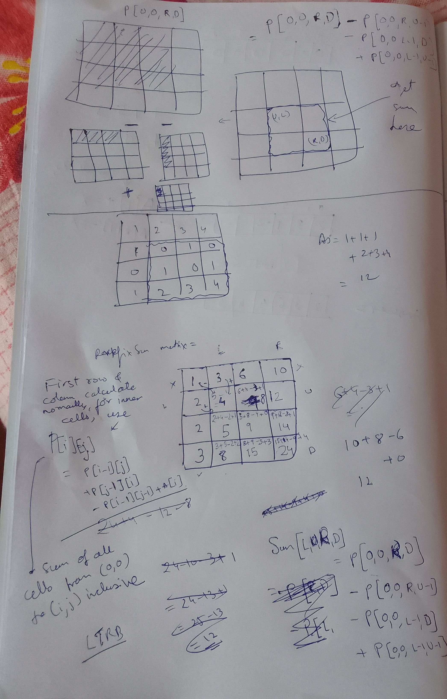

## Description

Given a 2d array `arr[][]`, 

Queries of the form `? L R U D` - find sum of rectangle formed by rectangle formed by `L, R, U, D inclusive`

## Prefix sum table calculation (in O(n * m))

`P[i][j] = prefix sum of all elements from [0][0] cell to [i][j] cell inclusive`

Recurrence involving top, left, and top-left cell and element itself
```py
for i in 1 to rows:
    for j in 1 to cols:
        P[i][j] =   P[i-1][j]     # sum all elements of row above 
                    + P[i][j-1]   # sum of all elements of column before
                    - P[i-1][j-1] # remove duplicate sum
                    + A[i]        # consider element itself
```


## 2-D range sum calculation

```
Sum[L,U,R,D] = P[0,0,R,D] - P[0,0,L-1,D] - P[0,0,R,U-1] + P[0,0,L-1,U-1]
```

## calc




