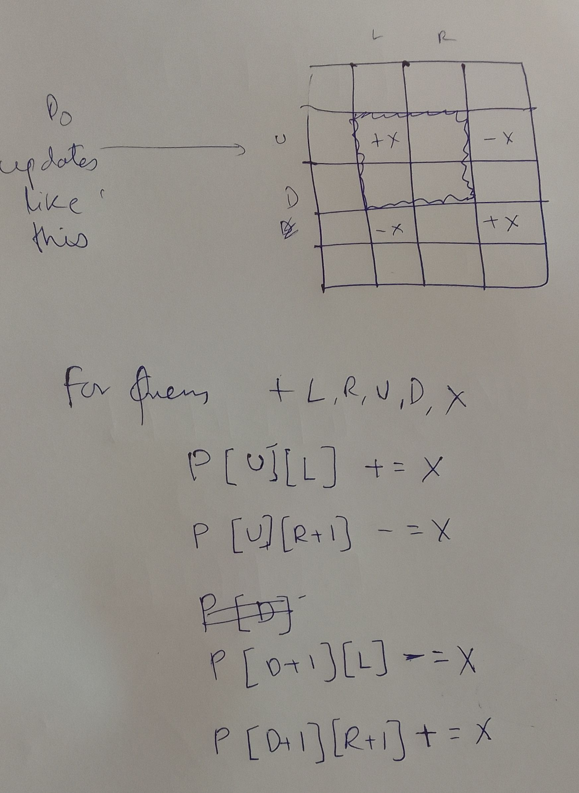

Given a 2d matrix intially with all zeros,

We get queries `+ L R U D X` queries, where we must add `X` to all cells from `U,L` to `R,D`

Answer = final 2d array with all the updates done.

## Core idea

Same as for 1d, refer here: [1d partials sums](PartialSums.md)

## Updates needed

```
A[U][L] += X;
A[U][R+1] -= X;
A[D+1][L] -= X;
A[D+1][R+1] += X;
```

### Then calculate prefix sum over 2d array using following

Refer [2d prefix sum](2DPrefixSums.md)

## Idea diagram


