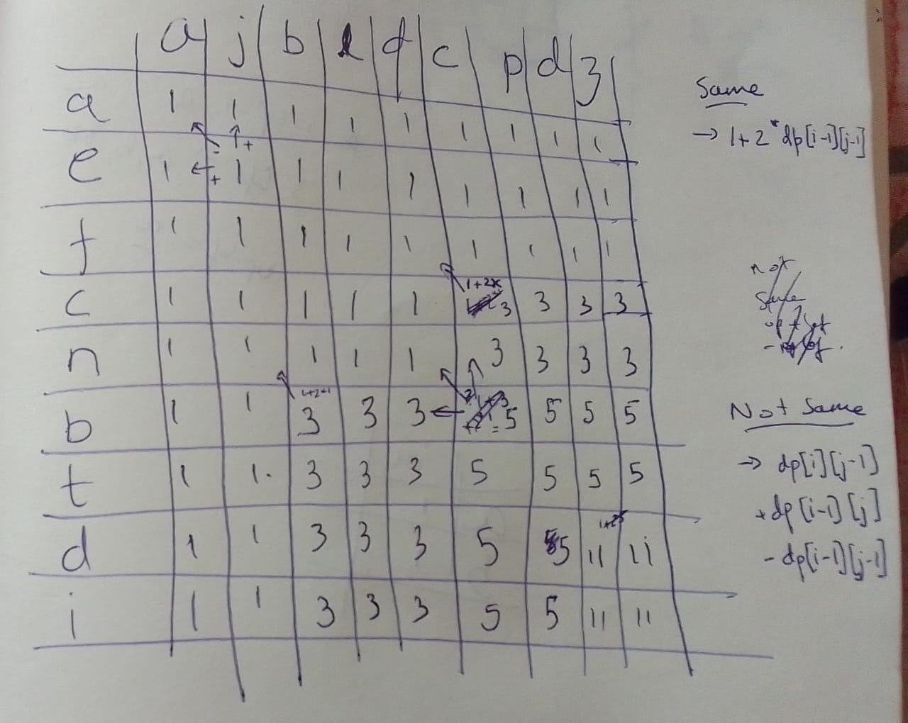

##

https://www.geeksforgeeks.org/count-common-subsequence-in-two-strings/

##

There is a recurrence that must be followed:

## State

`numCommonSubsequences[i][j] = number of common subsequences upto ith char in first string s1, and jth char in second string s2`

## Transitions

### s1[i] != s2[j]

If `ith` char of s1 is not equal to `jth` char of s2, i.e. `s1[i] != s2[j]`
`numCommonSubsequences[i][j] = numCommonSubsequences[i-1][j] + numCommonSubsequences[i][j-1] - numCommonSubsequences[i-1][j-1]`

Proof:
We add previous/smaller problem counts, and substract the double added.

### s1[i] == s2[j], ith char of s1 is same as jth char of s2

if `ith` char is same as `jth` char,
`numCommonSubsequences[i][j] = 1 + 2 * numCommonSubsequences[i-1][j-1]`, 

Proof for this: 
* we add 1 subsequence because ith & jth char match
* We already have `numCommonSubsequences[i-1][j-1]` from `s[1..i-1]`,`t[1..j-1]`
* We extend all previous `numCommonSubsequences[i-1][j-1]` subsequences with this new/fresh char

### Table filling

### Code TODO
