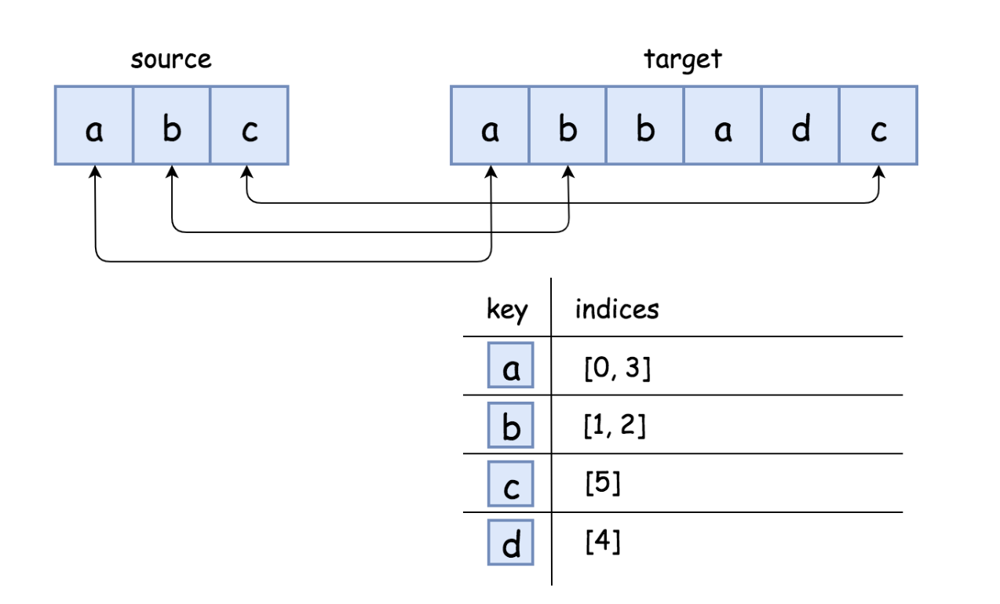

## 

determine if `s` is a subsequence of `t` - https://leetcode.com/problems/is-subsequence/

**Note: here we only delete chars from t, not from s.**

## Two pointers approach - O(T)

increment in when match, otherwise skip, at the end of loop, all chars in pattern must be found once.

We might return early, if all chars of s are found early inside t. but in worst case this is O(T).


### Code for two pointers approach

```java
// check if string s is a subsequence of string t
public boolean isSubsequence(String s, String t) {
    int sIdx=0;
    int tIdx=0;
    while(sIdx != s.length() && tIdx != t.length()) {
        if(s.charAt(sIdx) == t.charAt(tIdx)) {
            sIdx++;
        }
        tIdx++;
    }
    // all s were found
    if(sIdx == s.length()) {
        return true;
    }
    return false;
}
```

## Recursive decomposition of problem

// if char matches, we find answer in remaining string
// if not matches, 

isSubsequence(s, t) = (s.charAt(0) == t.charAt(0)) ? isSubsequence(s-1,t-1) : isSubsequence(s, t-1);

```java
class Solution {
    public boolean isSubsequence(String s, String t) {
        return isSubsequenceRecursive(s,t);
    }
    
    boolean isSubsequenceRecursive(String s, String t) {
        // base cases: s is satisfied
        if(s.equals("")) {
            return true;
        }
        // t exhausted but could not satisfy s
        if(t.equals("") && s.length() > 0) {
            return false;
        }
        // 
        boolean ans = false;
        // first char match, recurse on the rest
        if(s.charAt(0) == t.charAt(0)) {
            ans = ans || isSubsequenceRecursive(s.substring(1), t.substring(1));
        } else {// first char could not match, recurse on the rest
            ans = ans || isSubsequenceRecursive(s, t.substring(1));
        }
        return ans;
    }
}
```

## Edit distance formulation

a string s can be a subsequence of t, by either deletes in t, or by insertions in s.

## Variation: Serveral incoming source strings S1, S2, ... Sn and a fixed target string T

For each source string, we would incur O(T) (based on two pointers matching mentioned earlier).

### Build a hashmap from target string, with key is char, and value is indices list


**the pointer on the target string should move monotonically, i.e. in no case, we would move the pointer to an earlier position.**



for every char in s, we must have matching position in hashmap with index greater than current(monotonic increasing).


