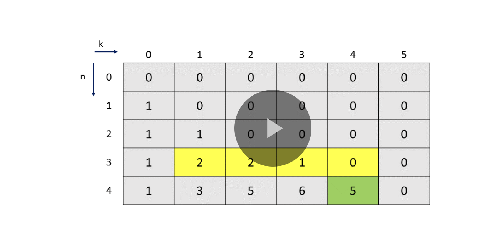

##


## 

WE have to find out recurrence using combinatorics:

some links:

https://leetcode.com/problems/k-inverse-pairs-array/discuss/2293243/DP-algo-explained-with-figures-Python

https://stackoverflow.com/questions/19372991/number-of-n-element-permutations-with-exactly-k-inversions

https://oeis.org/A008302

## The maximum possible inversions go from 0 to nC2

## Observation: no of 0 inversions is always 1

## Pattern observation:

For n = 3,

we observe:
```
no of 0 inversions: 1
no of 1 inversions: 2
no of 2 inversions: 2
no of 3 inversions: 1
```

For n = 4: (this sequence can be obtained using previous sequence using cumulative window sum of varying lengths)
```
no of 0 inversions: 1
no of 1 inversions: 3
no of 2 inversions: 5
no of 3 inversions: 6
no of 4 inversions: 5
no of 5 inversions: 3
no of 6 inversions: 1
```



## TODO understand full problem/recurrence derivation

https://leetcode.com/problems/k-inverse-pairs-array/solution/

