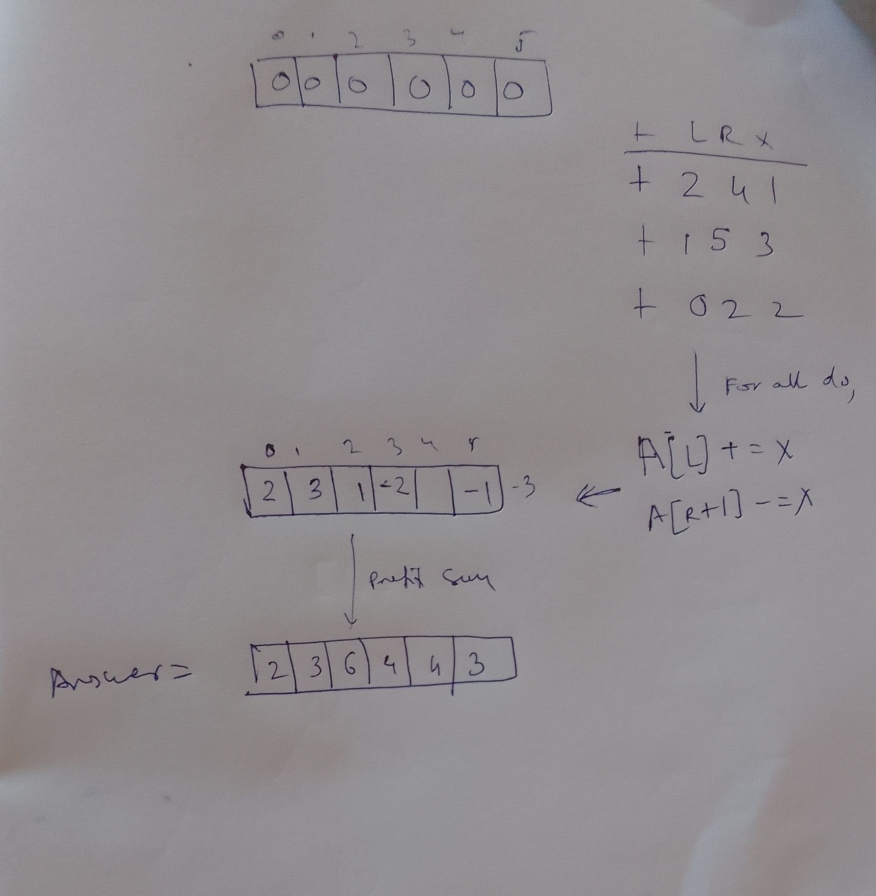

##

We are given an array `A`.

We are given range updates/queries of the form `+ L R X`: meaning update all elements in A from index L to index R(inclusive) by adding X to elements.

Desired answer: final array A after all the updates.

## Technique

```py
for {L, R, X} in Query Q:
    A[L] = A[L] + X
    A[R+1] = A[R+1] - X
ans = prefixSum(A)
```

## 



## Proof

Whenever we introduce +X in an index in main array, in the prefix sum universe we are adding to all index including and after L.
Similarly when we do `-X` in an index, in the prefix sum universe, we are subtracting `(-X)` from all index including and after R+1, negating effect of `+X`, in all indexes after R.


