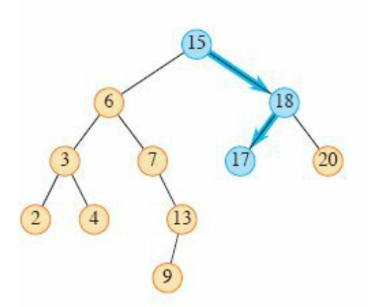
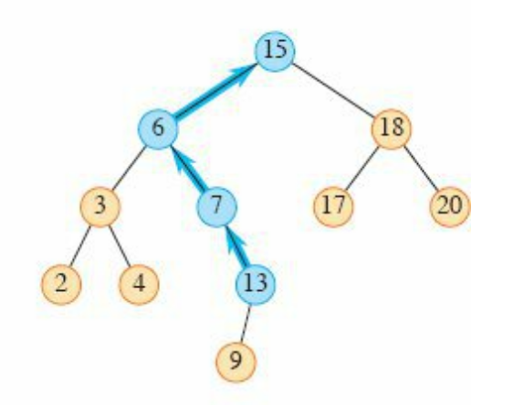

##


**Imp** - **clarify if parent pointers are present or not** in the data structure?

Variant: Without parent pointers: https://leetcode.com/problems/inorder-successor-in-bst/

# Approach 0 (Without parent pointers): Do inorder tree walk, save it in array, iterate or Binary search on array to find next element

# Approach 1 (Without parent pointers) : keep track of previous in an inorder walk

If at any point the predecessor `previous` is equal to the node given to us, then the `current` node will be its inorder successor.

# Optimal approach (Using BST approach) - from leetcode solutions

Assumption: You are given both the root node ref and the given node ref.

## Case 1: Right subtree exists (search min in right subtree)

Search min in right subtree

## Case 2: Right subtree does not exist (So travel from root to given node)

### Core observation: The inorder successor must exist on path from root to given node (or null if all elements are smaller from root to p)

Let `intermediate` path be the path from `root to given node`.

Proof:
case 1: inorder successor is to the right subtree of root (or right subtree of intermediate node along path to root), but given node is on left of root somewhere.
This is a contradiction, since root (or intermediate path node) would be a better answer (smaller key greater than given node).

Case 2: inorder successor in left subtree of given node - not possible, as all nodes to left of given node are smaller.

Case 3: right subtree does not exist, so cannot be in right subtree.

### Algorithm: Traverse from root to node to leaf, updating as per conditions

```java
// p is given node who's successor we want to find
TreeNode successor = null;
while (root != null) {// we will traverse from root till the end of tree
    if (root.val <= p.val) {// root cannot be a successor(too small), look at right subtree
        root = root.right;
    } else {// root is a potential successor (since it is larger), record and look at smaller left subtree for better candidate
        successor = root;
        root = root.left;
    }
}
```

# Varaint : Approach with parent pointers: Assuming **parent pointers are present for each node** 

Solution is taken from CLRS book

https://leetcode.com/problems/inorder-successor-in-bst-ii/

## If all keys are distinct, successor of node x is node with smallest key greater than x.key

## It is also the next node in an inorder-tree-walk

## If x is last node in BST, the successor would be null

## Case 1: Right subtree exists

Check node `15` in below diagram



### If right subtree exists, then min element in the right subtree is the inorder successor

## case 2: Right subtree does not exist i.e. null

Check node `13` in below diagram



### If right subtree does not exist, answer is somewhere in the parent nodes (Find first right turn from p)

Starting from x, find first right turn in parent(s), answer is first node after the turn. This is semantically equivalent to - lowest ancestor of x, whose left child is also an ancestor of x.
if there is no right turn, successor is nil/null

## Algorithm

```java
// x is given node whos inorder successor we want to find
TreeNode successor = null;
if(x.right != null) {// right subtree exists, find min in that tree
    return findMin(x.right);
}

// right subtree does not exist,
// check in parents for a right turn
TreeNode p = x.parent;// p starts as parent of x
while(p != null && p.right == x) {// keep climbing the left road from x, it will break when p.left = x or p becomes null
    x = p;// first update x
    p = p.parent;// then p
}
return p;
```

