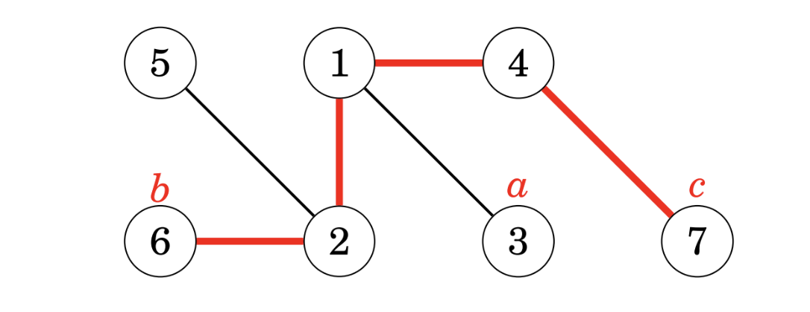
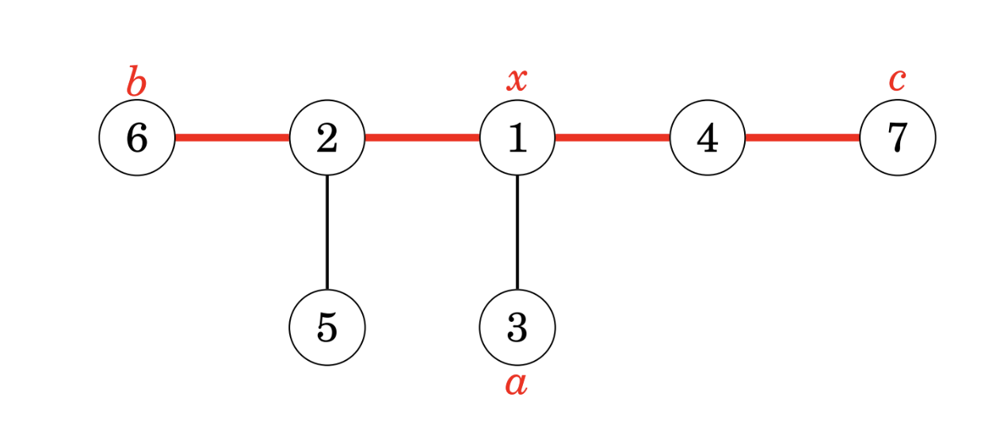
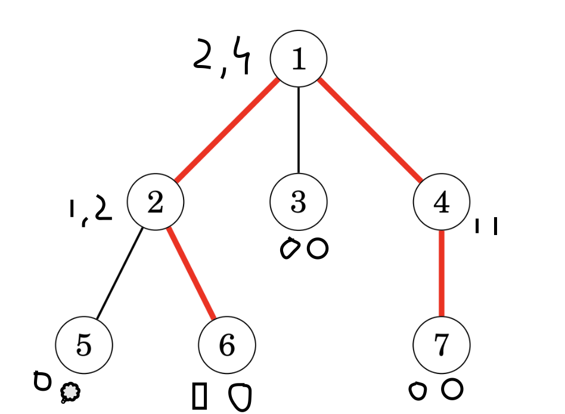

## Two BFS approach

### Start from any node and do a BFS

Find the farthest node in that BFS.

### Observation: Farthest node in first BFS is guaranteed to be in diameter

Proof: By condradiction.
Lets say last node found in first bfs is not a part of diameter.

Case 1: other node is at lower length than first bfs -  then we can pick our first bfs endpoint to give a better diameter
case 2: other node is at equal length as first bfs endpoint - then we will get same diameter.
Case 3: other node is at larger length than first bfs endpoint - in that case BFS would have picked up this alternative as the farthest node in BFS.

### Do a second BFS from the first bfs endpoint, this will give you diameter length

## DP approach

### Highest point of path

Observation: Every path in a rooted tree has a highest point: The `highest point that belongs to that path.`

### For each node, calculate longest path whose highest point is current node

Calculate two values
`toLeaf[x]` - max distance from x to any leaf
`maxLength[x]` - max path distance where x is the highest point (x is not the endpoint, may be in middle of the path).

### toLeaf recurrence

Base case (x is a leaf):
`toLeaf(x) = 0`

Recursive case:
`toLeaf(x) = max(toLeaf(x.left), toLeaf(x.right)) + 1`, In N-ary tree, find max toLeaf(child) among all children.

### maxLength recurrence

Base case: (x is leaf)
`maxLength(x) = 0` 

Recursive case:
Pick two children with max possible toLeaf sum (priority queue?), and add two
`maxLength(x) = maxToLeaf(a) + maxToLeaf(b) + 2`

### Final ans

Check `maxLength` array for maximum value.

## Variant: report the diameter nodes?