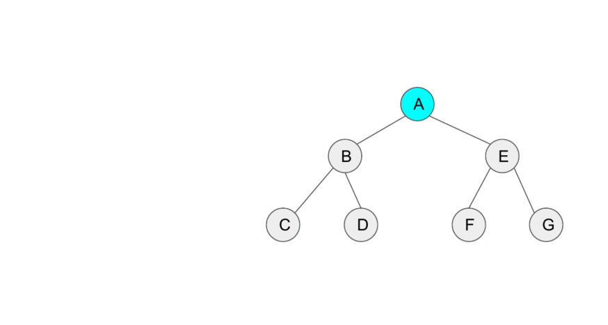

Tree traversal algorithm that does not use recursion/stack i.e. in O(1) space.

## Links are created as successors

## Base cases

### Leaf node: visit self, finish

### No left subtree: Visit and tail-recurse (iteration) on right side

Idea, no need to come back up from right side, because there is no need to process anything.

## Key idea

memorize the current node before going left (create link). 
And the moment we notice that such a connection has already been created, delete it and visit the node.


## Animation



## Code

```py
def MorrisTraversal(root):
    # Set cursor to root of binary tree
    cursor = root
    while cursor is not None:
        if cursor.left is None:
            print(cursor.value)
            cursor = cursor.right
        else:
            # Find the inorder predecessor of cursor
            pre = cursor.left
            while True:
                if pre.right is None:
                    pre.right = cursor
                    cursor = cursor.left
                    break
                if pre.right is cursor:
                    pre.right = None
                    cursor = cursor.right
                    break
                pre = pre.right
```

## Variant: Reverse morris traversal

https://www.geeksforgeeks.org/reverse-morris-traversal-using-threaded-binary-tree/

