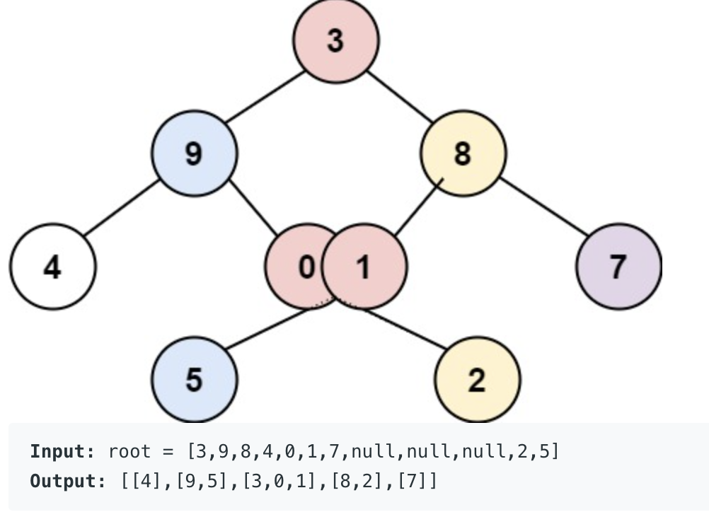

## 
https://leetcode.com/problems/binary-tree-vertical-order-traversal/

## Where I got stuck

I applied simple recursive DFS with passing col+1,-1 for right and left child,
but there is an edge case that i missed:

some deep left leaf of right root subtree, can enter/show up in column of left root subtree.
**In essence depth is also important to maintain, in a single column**

Here is an edge case:
Here DFS code will process and append 2 before 8, bcoz it appears in left subtree.


## My follow up approach

Pass level & columnNO to each node recursively:
we will have  a Treemap mapping from columnNo -> nodeSet (ordered set via TreeSEt) of `<num,level>`, ordered by comparator that prioritises level.

Set does not work - for multi values,
instead use a arraylist, and sort it.

## DFS Idea (maintain level + colNo recursive) + `extra map(colKey, list<numLevel>)` data structure

DFS where you pass both level & column:
```java
    public void traversalHelper(TreeNode root, int columnNo, int level, Map<Integer, List<NumLevelPair>> ans) {
```

Store in a Treemap where key is columnNo, and value is `List<NumLevelPair>`

In post processing,
for each column, for which we get `List<NumLevelPair>`, we will run a `Collections.sort`, which is a stable sort,
so we will preserve level also.

## Code

```java
/**
 * Definition for a binary tree node.
 * public class TreeNode {
 *     int val;
 *     TreeNode left;
 *     TreeNode right;
 *     TreeNode() {}
 *     TreeNode(int val) { this.val = val; }
 *     TreeNode(int val, TreeNode left, TreeNode right) {
 *         this.val = val;
 *         this.left = left;
 *         this.right = right;
 *     }
 * }
 */

class NumLevelPair{
    public int num;
    public int level;
    
    public NumLevelPair(int num, int level) {
        this.num = num;
        this.level = level;
    }
}

class Solution {
    public List<List<Integer>> verticalOrder(TreeNode root) {
    
        Map<Integer, List<NumLevelPair>> ans = new TreeMap<>();// key is column
        traversalHelper(root, 0,0, ans);
        //List<List<Integer>> ret = new ArrayList<>(ans.values());
        return processAnswer(ans);
    }
    
    public List<List<Integer>> processAnswer(Map<Integer, List<NumLevelPair>> traversal){
        Comparator<NumLevelPair> sortOnLevel = new Comparator<NumLevelPair>() {
            @Override
            public int compare(NumLevelPair o1, NumLevelPair o2) {
                return o1.level - o2.level;
            }
        };

        List<List<Integer>> ret = new ArrayList<>();
        for(List<NumLevelPair> list: traversal.values()) {// iteration order from leftmost column to right most column
            Collections.sort(list, sortOnLevel);// stable sort on level, shorter levels appear first
            List<Integer> singleColumn = new ArrayList<>();
            for(int i=0;i<list.size();i++) {
                singleColumn.add(list.get(i).num);
            }
            ret.add(singleColumn);
        }
        return ret;
    }
    
    public void traversalHelper(TreeNode root, int columnNo, int level, Map<Integer, List<NumLevelPair>> ans) {
        if(root == null) {
            return;
        }
        Integer nodeVal = root.val;
        //System.out.println("visiting node: " + nodeVal + " colNo: " +columnNo + " level = " + level);
        List<NumLevelPair> valList = ans.get(columnNo);
        if(valList == null) {
            valList = new ArrayList<NumLevelPair>();
        }
        valList.add(new NumLevelPair(nodeVal,level));
        ans.put(columnNo, valList);
        
        traversalHelper(root.left, columnNo - 1, level+1, ans);
        traversalHelper(root.right, columnNo + 1, level+1, ans);
    }
}
```