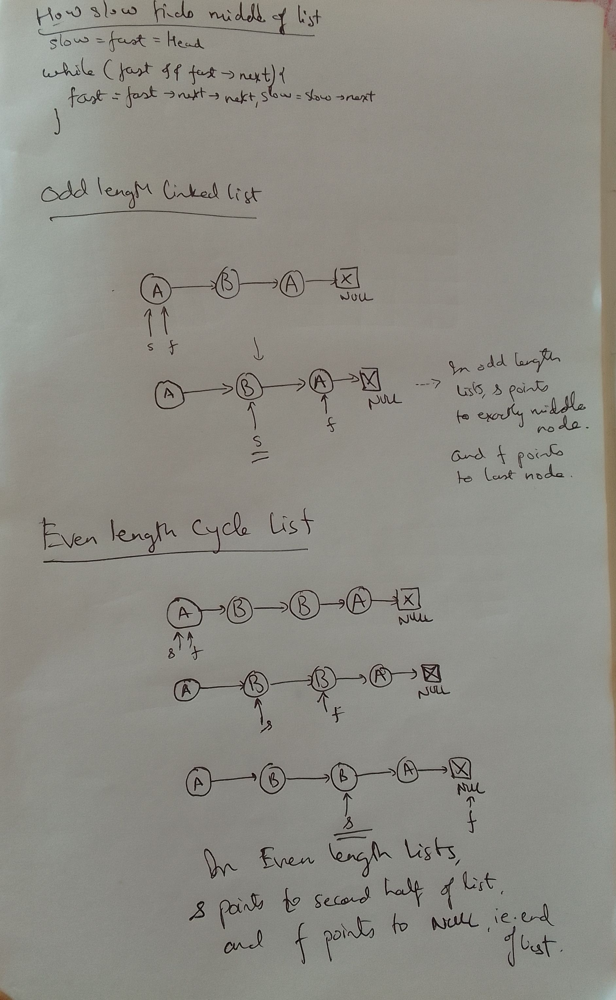

## Maintain two pointers: fast and slow

Both pointers start at head

## fast moves two steps, slow moves one step, iteration stopping condition

```java
Node slow, fast = head;
while(fast && fast.next) {
    fast = fast.next.next;
    slow = slow.next;
}
```

## Termination

At the end of termination,
slow points to middle of list
1. exact middle in case of odd length list
2. start of second half of linked list in case of even length list

Fast points to end of list
1. last node in case of odd length linked list
2. Null node in case of even length list

## 

