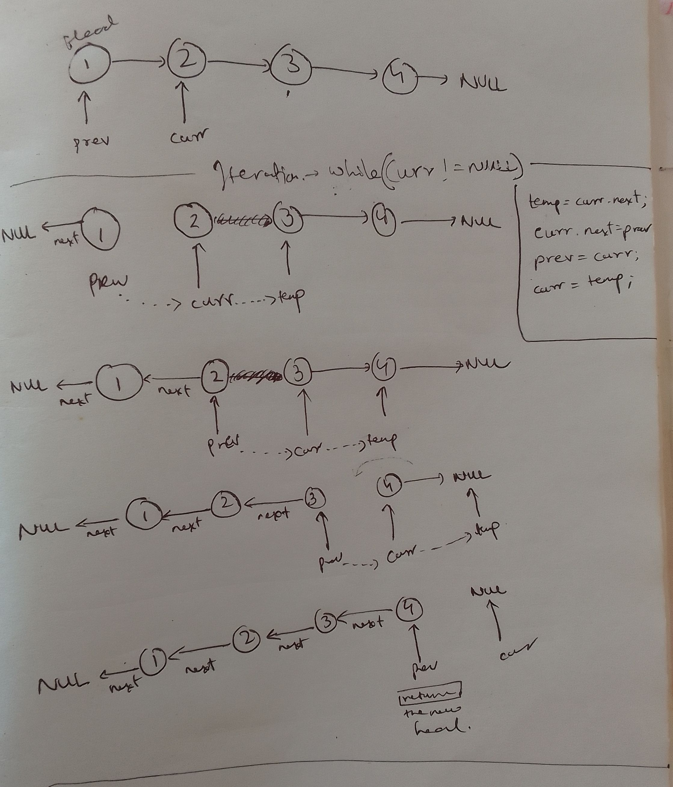

https://leetcode.com/problems/reverse-linked-list/


## In start, Keep two pointers, curr & prev, and intermediate temp pointer in iteration

## Start before iteration

```java
prev = head;
curr = head.next;
prev.next = null;
```

## iterate and keep manipulating pointers

stop condition `curr != null`. so after iteration ends, `curr` will be `null`.

During iterartion, we keep one more extra pointer `temp` to record where will curr be.

At the end of iteration, `prev` points to last node in original list, which will be the new head 
in reverse linked list so we `return prev`.


## Diagrams



## Code

```java
    public ListNode reverseList(ListNode head) {
        if(head == null) {
            return null;
        }
        
        ListNode prev = head;
        ListNode curr = head.next;
        prev.next = null;
        while(curr != null) {
            ListNode temp = curr.next;
            curr.next = prev;
            prev = curr;
            curr = temp;
        }
        return prev;
    }
```


## Recursive Linked list reversal

TODO