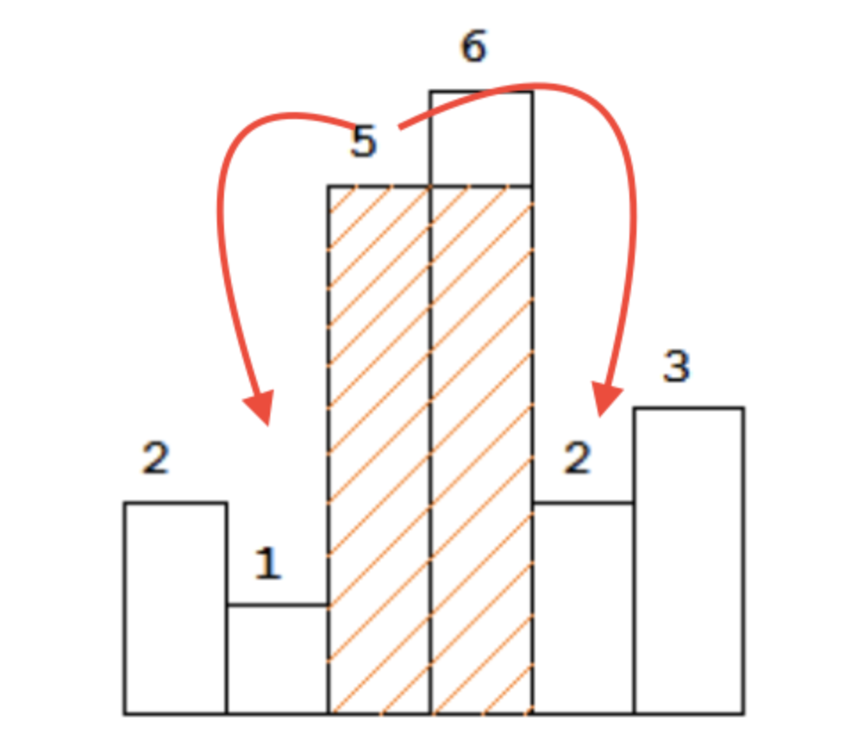

https://stackoverflow.com/questions/4311694/maximize-the-rectangular-area-under-histogram
https://www.algotree.org/algorithms/stack_based/largest_rectangle_in_histogram/

## Bruteforce

O(n^3) to consider every pair, and also find min within that pair and keeping track of maxArea

## O(n) solution with stacks

### PRe-requisite : Monotonic stack problems

Finding next/previous smaller/greater elemnts is a known problem that can be solved by using Monotonic stack: [Monotonic stack](MonotonicStack.md)

### First observaton (Need smaller element on both sides)

To find the maximal rectangle, if for every bar `x`, we know the first smaller bar on its each side, 
let's say `l` and `r`, we are certain that `height[x] * (r - l - 1)` is the best shot we can get by using height of bar `x`. In the figure below, 1 and 2 are the first smaller of 5. 

Keep a track of max so far.

