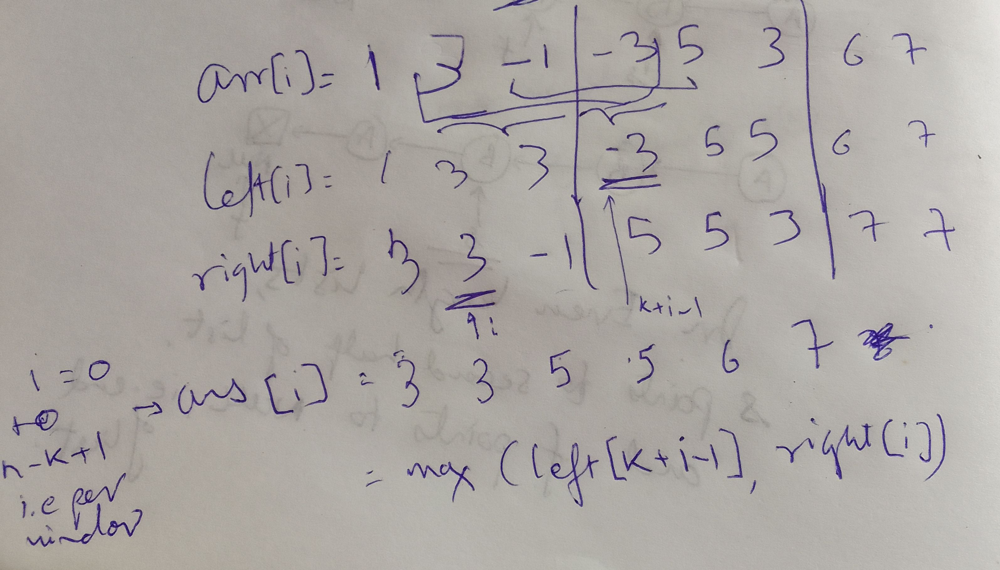

##

Given a window of size k, report maximum of all such windows

There are `n-k+1` windows.


## Brute force approach

`O(n-k+1 * k)`, for each k-mer i.e k sized window (there are n-k+1 such windows), we check max in it and save it in array.

## Better Via Monotonic Queue

Why think of queue?
Since elements that were added to the window first would be removed first.
In general queues can be a useful approach for sliding window problems since they have similar charechteristics.

### Monotonic decreasing queue for sliding window maximum

```java
class Solution {
    public int[] maxSlidingWindow(int[] nums, int k) {
        Deque<Integer> dq = new ArrayDeque<Integer>();// monotonic decreasing queue
        int[] ans = new int[nums.length - k + 1]; // there are n-k+1 windows in an array of length n where each window is of size k
        
        // get max for first k elements
        for(int i=0;i<k;i++) {
            int el = nums[i];
            // some of the first k elements might also end up in deque hence this pocessing.
            if(dq.isEmpty()) {
                dq.add(el);
            } else if (el > dq.peekFirst()) {
                dq.clear();
                dq.add(el); 
            } else {
                while(dq.peekLast() < el) {
                    dq.removeLast();
                }
                dq.add(el);
            }
        }
        ans[0] = dq.peekFirst();
        
        // window shifting starts
        for(int i=k;i<nums.length;i++) {// starting to shift window
            int newEl = nums[i];
            // new element entering the window larger than everything in the window
            // so clear the deque and add element
            if(newEl > dq.peekFirst() || dq.isEmpty()) { 
                dq.clear();
                dq.add(newEl);
            } else {
                // add it to queue such that monotonic decreasing
                while(dq.peekLast() < newEl){
                    dq.removeLast();
                }
                // we allow to add duplicates to queue
                dq.addLast(newEl);
            }
            if(nums[i-k] == dq.peekFirst()) {// element leaving the window was same as deque start
                dq.removeFirst();
            }
            ans[i-k+1] = dq.peekFirst();// check index arithmetic
        }
        return ans;
    }
}
```

## Bi directional DP based approach

### Split into blocks of size k (disjoint)

The idea is to `split an input array into blocks of k elements`. 
The last block could contain less elements if `n % k != 0`.

### core idea, the max will definitely be captured in either right walk or left walk

If max was missed in left to right walk, it is captured in right to left walk.

### Proof: Case wise analysis:

#### Case 1: window is same as block

In that we case have trivial ans, max of block is max of window

#### Case 2: window is split between two blocks (`b` & `b+1th` block)

Assume, p elements in block b, then k-p elements in block b+1.

`Subcase 1`: max element is in first p elements, i.e part of block b
it will be captured in right to left walk.

`subcase 2`: max element in remaining k-p elements i.e part of block b+1,
In that case it will be captured in left to right walk.

### Calculate two arrays `left[i]` and `right[i]`

`left[i]` - max element in block up to index i, block starting from left.

`right[i]` - max element in block up to index i, block starting from right.

`ans[i]` = `max(left[k+i-1], right[i])`

### Example diagram



### Code

```java
class Solution {
    public int[] maxSlidingWindow(int[] nums, int k) {
        int[] left = new int[nums.length];
        int[] right = new int[nums.length];
        int[] ans = new int[nums.length-k+1];// n-k+1 windows/k-mers
        
        // fill the left array
        int maxSeen = nums[0];
        for(int i=0;i<nums.length;i++) {
            if(i %k == 0) {// new block starting, reset maxSeen for that block
                maxSeen = nums[i];
            }
            if(nums[i] > maxSeen) {
                maxSeen = nums[i];
            }
            left[i] = maxSeen;
        }
        // System.out.println(Arrays.toString(left));
        
        // fill the right array
        maxSeen = nums[nums.length-1];
        for(int i= nums.length-1;i>=0; i--) {
            if((i%k) == k-1) {// take care in this condition
                maxSeen = nums[i];
            }
            if(nums[i] > maxSeen) {
                maxSeen = nums[i];
            }
            right[i] = maxSeen;
        }
        
        // System.out.println(Arrays.toString(right));
        
        // find ans
        for(int i=0;i<nums.length-k+1;i++) {// i runs from 0 to n-k+1, i.e. for each window
            ans[i] = Math.max(left[k+i-1], right[i]);
        }
        // System.out.println(Arrays.toString(ans));
        return ans;
    }
}
```