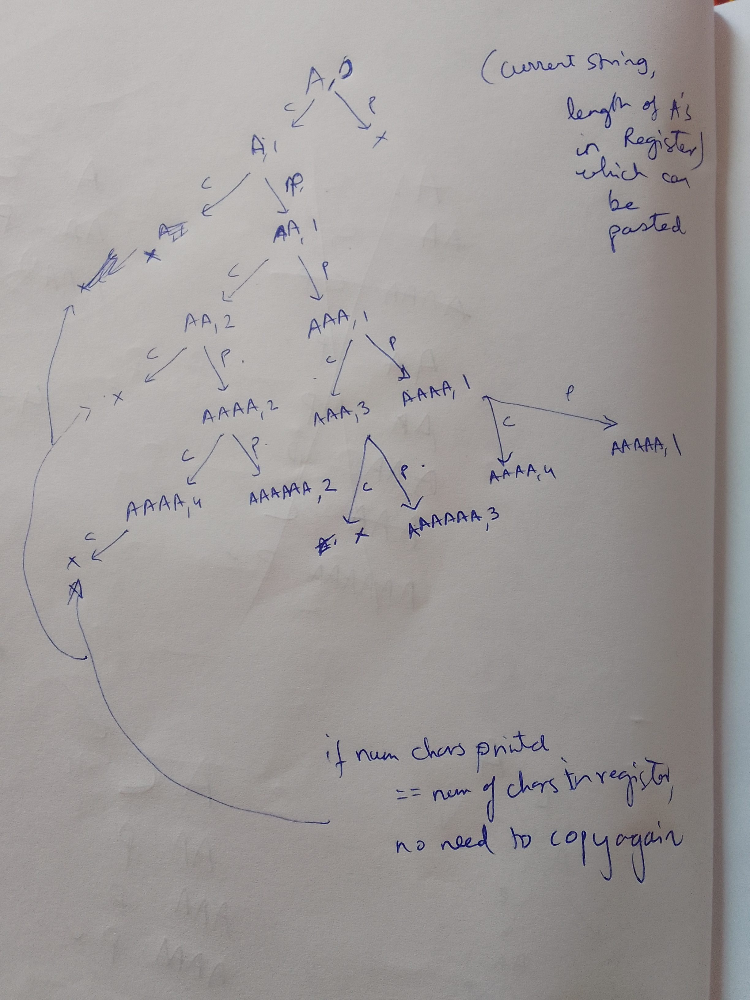

##

https://leetcode.com/problems/2-keys-keyboard/

##

There is only one character 'A' on the screen of a notepad. You can perform one of two operations on this notepad for each step:

Copy All: You can copy all the characters present on the screen (a partial copy is not allowed).
Paste: You can paste the characters which are copied last time.
Given an integer n, return the minimum number of operations to get the character 'A' exactly n times on the screen.

 

Example 1:
```
Input: n = 3
Output: 3
Explanation: Initially, we have one character 'A'.
In step 1, we use Copy All operation.
In step 2, we use Paste operation to get 'AA'.
In step 3, we use Paste operation to get 'AAA'.
```

Example 2:
```
Input: n = 1
Output: 0
 ```

Constraints:
```
1 <= n <= 1000
```

## copy/paste Choice Recursion graph



## Recursion and pruning ideas

PRuning ideas:
1. if number of As printed is same as number of As in register, no need to go the copy path
2. Only recurse if total As printed after paste is less than or equal to n.

## Code 

```java
class Solution {
    int[][] ansmemo;
    public int minSteps(int n) {
        
        if(n == 1) {
            return 0;
        }
        
        ansmemo = new int[n+1][n+1];
        for(int i=0;i<ansmemo.length;i++) {
            for(int j=0;j<ansmemo[0].length;j++) {
                ansmemo[i][j] = -1;
            }
        }
        
        int ans = backtrackHelper(1, 1, n, 1);// initially start with only copy, no paste can be done initially
        
        return ans;
    }
    
    // At each step we can do a copy or a paste
    int backtrackHelper(int numAsPrinted, int numAsInRegister, int n, int depth) {
        // System.out.println("numAsPrinted = "+ numAsPrinted + " numAsInRegister = " + numAsInRegister +" n = " + n +" depth = "+ depth);
        if(numAsPrinted >= n) {
            return depth;
        }
        if(ansmemo[numAsPrinted][numAsInRegister]  != -1) {
            return ansmemo[numAsPrinted][numAsInRegister];
        }
        
        int d = Integer.MAX_VALUE;
        if(numAsPrinted > numAsInRegister) {
            // choose copy
            d = Math.min(d,backtrackHelper(numAsPrinted, numAsPrinted, n, depth+1));
            
            if(numAsPrinted + numAsInRegister <= n) {// recursion bounding/pruning
                // choose paste
                d = Math.min(d,backtrackHelper(numAsPrinted + numAsInRegister,numAsInRegister, n, depth+1));
            }
        } else if(numAsPrinted == numAsInRegister) {
            if(numAsPrinted + numAsInRegister <= n) {// recursion bounding/pruning
                // only choose paste
                d = Math.min(d, backtrackHelper(numAsPrinted + numAsInRegister,numAsInRegister, n, depth+1));
            }
        }
        
        ansmemo[numAsPrinted][numAsInRegister] = d;
        return d;
    }
}
```