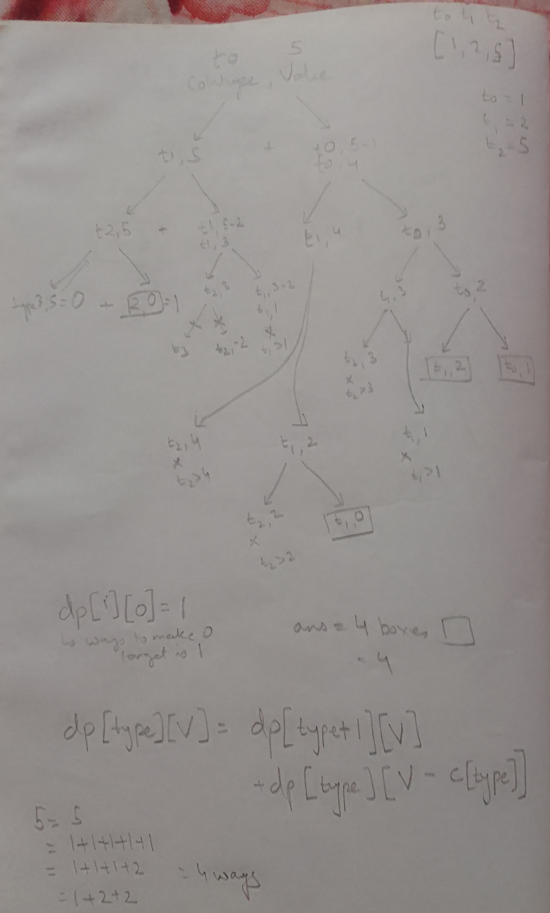

This is a variant of knapsack in following terms:
N -> amount we want to fulfill
coins -> items we want to fill/pick to make change for N.

https://www.youtube.com/watch?v=1mtvm2ubHCY

# variant 1 - Min no. of coins needed 

Min number of coins needed to make change

## given coins c

c = {c1, c2, ... cn}

## recurrence

solve(x) = min(solve(x - c1)+1, solve(x-c2)+1, ... , solve(x-cn)+1)

## recursive solution

```cpp
int solve(int x) {
    if (x < 0) return INF;
    if (x == 0) return 0;
    int best = INF;
    for (auto c : coins) {
        best = min(best, solve(x-c)+1);
    }
    return best;
}
```

## memoization applied

## bottom up iterative tabulation

## constructing solution

# variant 2 - count number of ways(ordering matters), each coin be picked any number of times?

```
Input: nums = [1,2,3], target = 4
Output: 7
Explanation:
The possible combination ways are:
(1, 1, 1, 1)
(1, 1, 2)
(1, 2, 1)
(1, 3)
(2, 1, 1)
(2, 2)
(3, 1)
Note that different sequences are counted as different combinations.
```

## dp state

`dp[i] = no of ways to partition/count i`

## Base case 

`dp[0] = 1` 1 way, which means select nothing

## dp recurrence

`dp[i] = dp[i-1] + dp[i-2] + ... + dp[i-k]` where we have k coin denominations

https://cses.fi/problemset/task/1635
https://leetcode.com/problems/combination-sum-iv/

```java
    public int combinationSum4(int[] nums, int target) {
        int ways[] = new int[target+1];
        
        ways[0] = 1;
        for(int i=1;i<ways.length;i++) {// for each possible increasing target
            for(int j=0;j<nums.length;j++) {// for each coin
                if(i-nums[j] >= 0){
                    // each coin i.e. nums[j] represents a jump back in ways
                    ways[i] += ways[i-nums[j]];// we try to use each coin and add ways from there
                }
            }
        }
        return ways[target];
    }
```

# variant 2 - count number of ways(ordering matters), each coin be picked once

# variant 3 - count number of ways (ordering does not matter), each coin can be picked any number of times

```
Input: amount = 5, coins = [1,2,5]
Output: 4
Explanation: there are four ways to make up the amount:
5=5
5=2+2+1
5=2+1+1+1
5=1+1+1+1+1
```

https://cses.fi/problemset/task/1636
https://leetcode.com/problems/coin-change-2/

Since ordering does not matter we have to eliminate double counting from the prev variant.

### core idea: lexicographically pick coins

Since 1 + 2 + 1 can have three representations:
```
1 + 2 + 1
1 + 1 + 2
2 + 1 + 1
```

If we decide to lexicographically visit, e.g. always pick larger first, we will get a unique 
representation, and we will avoid extra counting:
`2 + 1 + 1`

### This introduces extra dimension of cointype i.e. last used coin type

### dp state

`dp[type][Value] = number of ways to make value with type considered upto given type in lexicographic order`

### Dp transition

`dp[i][0] = 1` = only 1 way to make 0 value, not select anything.

Forward recurrence = `dp[type][Value] = dp[type+1][Value] + dp[type][Value-coin[type]]`
`ans = dp[type][Value]`

Termination conditions for forward recurrence = `type == N` or `Value is -ve`, in that case count is 0.



### iterative dp table (fill row by row, left to right inside a row)

note when we are allowed multiple items/coins like unbounded knapsack, we can jump left in the same row for smaller subproblem,
if we are not allowed to repeat coin more than once, then we go both up and left in reucurrence table.

| coins\value     | 0 | 1 | 2 | 3 | 4 | 5 |
| --- | --- | --- | --- | --- | --- | --- |
| `[]`            | 1 | 0 | 0 | 0 | 0 | 0 |
| `[`**1**`]`     | 1 | 1 | 1 | 1 | 1 | 1 |
| `[`1,**2**`]`   | 1 | 1 | 2 | 2 | 3 | 3 |
| `[`1,2,**5**`]` | 1 | 1 | 2 | 2 | 3 | 4 |

Since we go row by row, outer loop is i = 0 to coin-types
inner loop goes from 0 to value
```java
    public int change(int amount, int[] coins) {
        int[][]dp = new int[coins.length+1][amount+1];//note table dimensions
        for(int i=0;i<=coins.length;i++){
            dp[i][0] = 1;// exactly one way to make 0 amount
        }
        for(int i=1;i<=amount;i++) {
            dp[0][i] = 0; // 0 ways to make any amount from no coins
        }
        
        for(int i=0;i<coins.length;i++) { // consider ith coin
            for(int j=1;j<=amount;j++) { // consider all amounts to filled with it
                //i+1th row corresponds to considering ith coin in dp table
                dp[i+1][j] = ((j-coins[i] < 0) ? 0 : dp[i+1][j-coins[i]]) + dp[i][j];
            }
        }
        
        return dp[coins.length][amount];
    }
```

### Dimensionally compressed solution

```java
class Solution {
  public int change(int amount, int[] coins) {
    int[] dp = new int[amount + 1];// amount dimension
    dp[0] = 1;

    for (int coin : coins) {// for each coin considered
      for (int x = coin; x < amount + 1; ++x) {// go from coin amount to end of amount
        dp[x] += dp[x - coin];// entries on right use entries on left, filling from left to right
      }
    }
    return dp[amount];
  }
}
```

# variant 3 - count number of ways (ordering does not matter), each coin can be picked once
