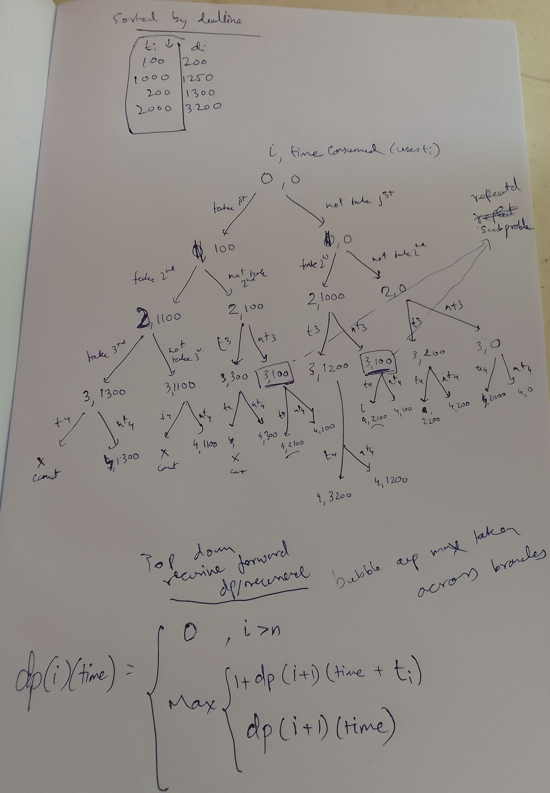

## Goal

The goal is to schedule a set of `n` requests,
for each request we are given deadline `d[i]` and duration length `t[i]`.
Each accepted request must be assigned an interval of time of length `t[i]`.

Here we are not given start time `s[i]` and finish time `f[i]`, but we get to choose depending on schedule we decide.

## Test cases
```
[[100,200],[200,1300],[1000,1250],[2000,3200]]
[[1,2]]
[[3,2],[4,3]]
[[5,5],[4,6],[2,6]]
```

Ans:
`3`
`1`
`0`
`2`

### variant 1: minimize lateness (i.e missing deadlines is allowed)

`Lateness`: Any job that misses deadline by `x` amount, then `x` is considered lateness.
`lateness[i] = f[i] - d[i]` where `f[i]` is finish time of ith job, `lateness[i] = 0 if f[i] <= d[i]`. 
In essence total lateness would be `sum(lateness[i])`.

### Variant 2: maximize number of jobs scheduled


## Greedy Approaches that can be taken

### Earliest deadline first: sort by deadline, finish the necessary one first

Failing test case for this approach: `[[5,5],[4,6],[2,6]]`
Expected output was : `2`, but approach gave `1`.

Contradiction: If we gave a smaller job (with a later deadline) a chance first i.e. `[2,6]`, we could have fit in two jobs.

### First sort by job length, then by job deadline

Failing test case for this approach: 
`[[5,15],[3,19],[6,7],[2,10],[5,16],[8,14],[10,11],[2,19]]`
Expected output was: `5`, but approach gave `4`.


### Tried to return best of both cases: following test case failed:

`[[7,17],[3,12],[10,20],[9,10],[5,20],[10,19],[4,18]]`
Expected output was: `4`, but approach gave `3`. 


## DP approach

### First sort by deadline

This helps us in directionality of dp, i.e. ordering of consideration of subproblems.

### How large should the dp table be?

Row dimension is items/courses i.e. `courses.length`
Column dimension is time, so it should be largest time possible + 1 (considering zero time)
Largest time = last course deadline time in the sorted array+1 = `courses[courses.length - 1][1] + 1`

So:
```java
Integer[][] memo = new Integer[courses.length][courses[courses.length - 1][1] + 1];
```

### top down approach

### Two dimensions in recursion - `i`th item being considered, given the time aleady consumed by the other courses is time `time`

### DP state

`dp[i][time] = max num of courses that can be taken starting from 0 to ith course, taking toal time "time"`

### DP Base cases

`dp[0][time] = 1 if time > courses[0][0] else 0`
`dp[N][x] = 0`: if past number of items, nothing can be taken


### DP state transition

### DP problem graph



### Code


## Iterative (n^2) nested for loop approach (remove previous heavy courses), O(1) space

### Key observation 1: must sort by deadline first

### Keep a running count cnt for max courses that can be picked

### Key observation 2: If ith course cannot be picked, find a previous course j to be removed, with t[j] >= t[i], so that i can fit.

Since jth previous job, which has time duration `t[j] >= t[i]`, on removal, can make enough space for ith job to be added.

`Why are we doing this step?` - The answer to this question is as follows. By replacing the `jth` course, with the `ith` course of a relatively smaller duration, we can increase the time available for upcoming courses to be taken. 

An extra `t[j] - t[i]` time can be made available by doing so.

### Which preivous course to remove for maximum savings?

Pick a previous course with maximum duration `t[j]` and greater than `t[i]`.

### On dumping a previous course j, mark its duration i.e t[j] with -1 for avoiding it from future considerations

### If no useful previous course can be found, don't take current course and mark current course duration i.e. t[i] with -1

### Code with explaination

```java
class Solution {
    public int scheduleCourse(int[][] courses) {
        // single course
        if(courses.length == 1) {
            if(courses[0][0] <= courses[0][1]) {
                return 1;
            } else {
                return 0;
            }
        }
        
        // many courses
        
        // first sort by deadline
        Arrays.sort(courses, (a, b) -> Integer.compare(a[1], b[1]));
        
        int time =0;
        int cnt = 0;
        
        for(int i=0;i<courses.length;i++) {// for each course
            if(time + courses[i][0] <= courses[i][1]) { // we can take course, take it
                time = time + courses[i][0];
                cnt++; 
            } else { // cannot fit ith course, look back to find biggest one we can replace
                int max_i = i;// pontential course id to dump
                for(int j=0;j<i;j++) {
                    if(courses[j][0] > courses[max_i][0]) {// we keep improving the best
                        max_i = j;
                    }
                }
                if(courses[max_i][0] > courses[i][0]) { // replace part
                    time = time - courses[max_i][0]; // untake previous course
                    time = time + courses[i][0]; // take current course
                }
                courses[max_i][0] = -1; // mark dumped course as useless for future
            }
        }
        
        return cnt;
    }
}
```


## O(N lg N) priority queue approach, with O(N) space

To improve upon previous approach, where we had to look back for a candidate course for removal via a loop.

### (MAX) Priority queue should contain all the courses taken until now.

Upon a course not fitting, remove the largest course from prio queue and add the current one as selected.

### At the end number of courses in PQ represents number of courses max taken.

### TODO Code


