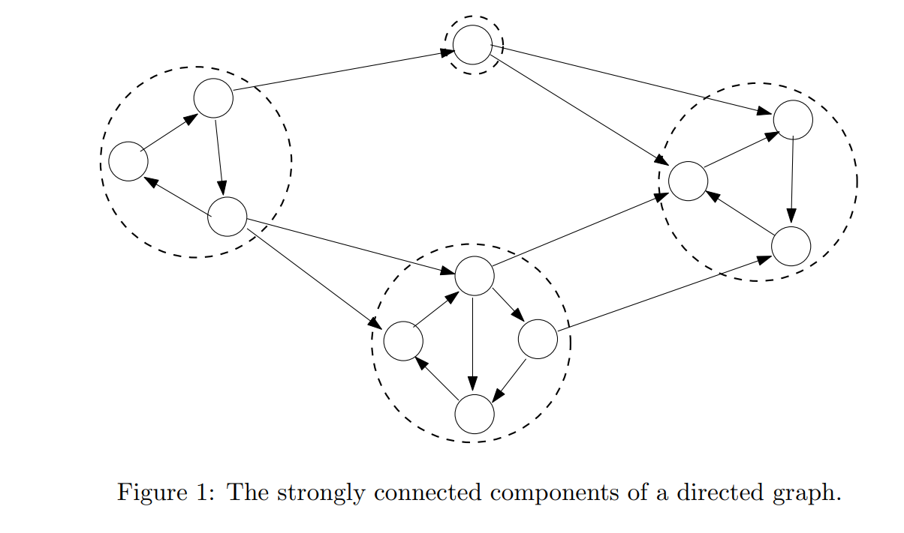
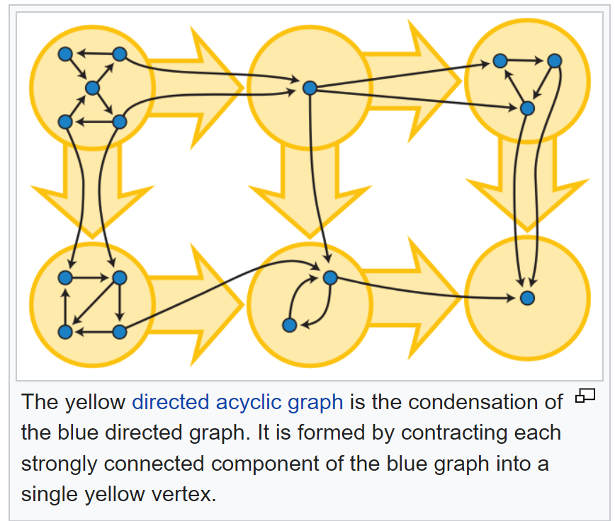

## REsources

https://web.stanford.edu/class/archive/cs/cs161/cs161.1138/lectures/03/Small03.pdf

https://www.topcoder.com/thrive/articles/kosarajus-algorithm-for-strongly-connected-components

https://www.youtube.com/watch?v=Rs6DXyWpWrI
https://www.youtube.com/watch?v=RpgcYiky7uw
## Strongly connected component

It is maximal subset of vertices C such that any two vertices of this subset are reachable from each other. 
i.e for any u,v in C: 
u -> v path exists, v -> u exists.

In other words, for every vertex inside a component, is reachable from every other vertex within the same component.

SCC partition a graph into disconnected partitions where each partition is a cycle.

## Condensation graph

Graph containing every strongly connected component as one vertex.

Each vertex of a condensation graph corresponds to a strongly connected component of original Graph G.

**Condensation graph will be acyclic, or in another words, SCCs of a graph form a DAG** - Proof by contradiction: if there was a cycle between two condensed vertices(i.e. components) A and B, it would be possible to  reach from any vertex inside A to any vertex inside B and they would not be two separate components. Hence Condensation graph must be acyclic.

Intuitively a two layer structure:
1. higher level a graph is a DAG between SCCs showing top level connections between cluster of nodes.
2. Lower level you see strong connections between nodes in the same component.

## Interesting properties of SCC

* Two SCCs C1 and C2 are either equal or distjoint.

* Every node belongs to exactly one SCC.

* SCCs of a graph form a partition of the nodes of a graph.

* The first vertex to be discovered in any component is also the last one to be finished in that component.
## DFS based linear time algorithms

### Kosaraju's algorithm

Two passes of DFS used.
1st DFS on regular graph.
Take transpose of the graph (i.e. reverse all edges).
Second DFS on transpose of the graph.

Why reverse edges?
The SCCs won't be affected since even after edge reversal, every node inside an SCC is still reachable.

reversal will also reverse the DAG edges of the SCC condensation graph.
in one of the cases (either normal graph or transpose graph), we will not be able to go from one SCC to other via DFS, thus helping us segregate between SCCs.

### Tarjan's algorithm

Single DFS pass used.

