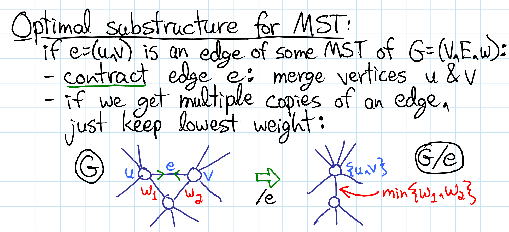
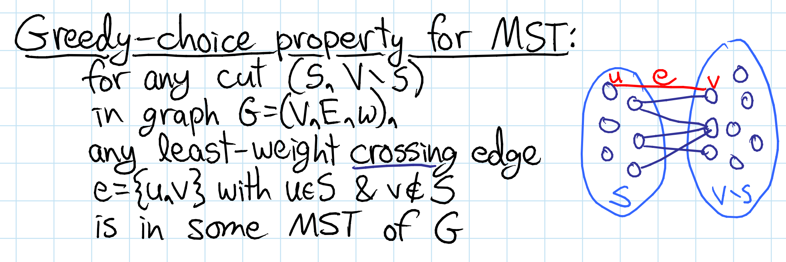

## Resources

https://ocw.mit.edu/courses/6-046j-design-and-analysis-of-algorithms-spring-2015/67e57b7bb3f1c85b3271937e3d355030_MIT6_046JS15_writtenlec12.pdf

https://ocw.mit.edu/courses/6-046j-design-and-analysis-of-algorithms-spring-2015/4a7fdddff3bc419c70bb470106a1663a_MIT6_046JS15_lec12.pdf

https://cp-algorithms.com/graph/mst_kruskal.html

https://cp-algorithms.com/graph/mst_prim.html

https://www.youtube.com/watch?v=jsmMtJpPnhU (Lazy prim - no relaxation)
https://www.youtube.com/watch?v=xq3ABa-px_g (Eager Prim - with relaxation)

https://www.youtube.com/watch?v=JZBQLXgSGfs

https://www.algotree.org/algorithms/minimum_spanning_tree/prims_c++/
https://www.algotree.org/algorithms/minimum_spanning_tree/prims_java/

## Goal

Given **weighted undirected** graph.
find a subtree which covers all vertices i.e. vertex set is same, edge set is a subset of original graph, i.e. a spanning tree which has least total weight(of all the edges). The weight of the tree is defined as sum of weight of all the edges in that tree.

There can be many valid spanning trees and also many valid minimum spanning trees, but all the valid Minimum spanning trees will have MST weight.

All nodes must be connected for spanning tree/Minimum spanning tree to exist.


## How many spanning trees can be present in a graph?

Exponential

## Edge contraction Idea

When you merge two nodes of an edge i.e. `(u,v)` into a single node `uv`, it is known as `edge contraction`.

**Notation** - `G/e` means `G` where `e` is contracted. 

The neighbouring edges from uv will now be a union of 
neighbors of `u` and neighbours of `v`.

What if `u` and `v` have a common neighbour `w`, i.e `u<->w` and `v<->w`?
In case of MST, have `uv<->w` as the new edge and keep min weight of the two edges `u<->w` and `v<->w`.




## GReedy choice property

For any Cut `(S, V-S)` in Graph G = (V,E,w),
anly least-weight crossing edge in e = {u, v} with `u in S` & `v not in S`, this edge {u, v} is in some MST of G.



Proof idea:
We have a min-weight edge `e` between Cut (S,V-S), that connects `u-v`, where `u in S, v in V-S`.
Picking min weight edge between Cuts i.e (S,V-S), always helps and never harms, also if there was another 
path/edge e' from `u<->v` that goes via the Cut (S,V-S), it would not be picked because, we already have a better choice `e` to bridge the Cut (S,V-S).

## Useful properties

* If all edge weights are distinct, there is a unique minimum spanning tree.

* MST is also the tree with min product of weights of edges(proved by replacing weights of all edges with their logarithms)


## Kruskal's algorithm (with Edge list + UFDS for cycle check)

* Sort Edges `e` based on their increasing weight (edge list DS instead )
* Greedily try to add edges into The MST so that they do not form a cycle.
* cycle check can be done via UFDS
* Conceptually forests  of small trees gradually merging into MST.


## Prim's algorithm (With Adjacency List representation)

There are two possible versions:
1. `lazy version` - no relaxation/update step, stale edges might end up in PQ but are checked again post popping from PQ.
2. `eager version` - has a relaxation/update step, this might require a indexed-priority-queue to do operations like decrease-key etc.

### Extra data structures needed
* A min heap/min priority queue for edge/vertex selection of `<weight, vertexid>` starting with (0,Sourceid). The order is important because of how PriorityQueue would be doing comparision on, first item i.e. weight then breaking ties with second item i.e. vertex-id. **If putting a custom pair/struct in PQ, implement your own comparator which compares basis weight**
* A visited/seen vector that represents the spanning tree vertices selected so far, so that we can avoid cycles

### Core algorithm (This version does not need any distance relaxation)

Shorter version:
1. get/select node from pq greedily (after popping, ignoring it if vertex was visited)
2. make it selected/seen and add the associated cost to mst-cost
3. for selected node in step1, put the un-selected/unseen neigbor nodes on pq and goto step 1. (here we ignore visited neighbours)

**Note** - how we ignore visited vertices twice, once after popping from pq, and next, before adding neighbours to PQ.

```
1.  Create a priority queue Q to hold pairs of ( cost, node ).
2.  Push [ 0, S ] ( cost, node ) in the priority queue Q i.e Cost of reaching the node S from source node S is zero.
3.  While ( ! Q.empty() )
4.       Item = Q.top(); Q.pop()
5.       Cost C = item.first and Vertex V = item.second
6.       If the node V is not present in the spanning tree // ignoring visited nodes after removing from PQ
7.           Add node V to the spanning tree.
8.           Cost of the spanning tree += Cost C
             // ignoring visited vertices once more before adding to pq
9.           For all the vertices adjacent to node V that are not in the spanning tree.
10.               Push pair of ( cost, adjacent node ) into the Q
```

Initial weights for all other vertices except the start is infinity (They are updated via edges that come from the cut).

**We maintain vertex<->weights mapping(Which are updated by discovering edges and their edge weights).**

* All processed nodes are kept track via a set S (representing source Set).
* select a vertex in (V-S) by inspecting all outgoing edges from the Cut S -> V-S, pick vertex which has min weight.
* From the selected vertex, Relax neighbour vertex weights via edges (decrease-key on vertex, indexedPQ, where index is vertex)
* Loop

### Prim's Lazy version - O(E * log E)

In lazy version, their is no relaxation/update step.
We blindly insert edges into PQ which could later become stale.

### Prim's Eager version - O(E * log V)

Track (node, edge) keyvalue pairs that can easily be **updated/relaxed** and polled to determine next best edge to add to the MST, needs an Indexed priority Queue. Somewhat similar to Djikstra's algorithm. Note **IPQ is bound/indexed by number of vertices not edges - it represents best seen weight from selected fringe set to that vertex**

In the final MST, each node is paired with exactly one incoming edge, it might have many outgoing edges, but incoming edge is always one in the final MST, i.e. indegree 1, for all nodes except the root (0 indegree).

Initially distances of all vertices except sources can be considered INF.

Core algorithm:
```
1. Maintian IPQ of size V that sorts vertex-edge pairs (v,e) based on min-edge cost of e.
2. Start algorithm on source node s.
3. relax all edges of s.
4. while IPQ is not empty and mst not formed
5.     deque next best (v,e) pair from IPQ
6.     mark node v as visited/selected // selection step
7.     add edge e to MST
8.     relax all edges of v, while making sure not to relax any edge pointing to node which has been already visited/selected.
```

Relaxation step:


### Prims implementation issues (cpp)

STL containers like `priority_queue` do not have `decrease_key` operation needed by prim's and djikstra's algorithm.

https://stackoverflow.com/questions/9209323/easiest-way-of-using-min-priority-queue-with-key-update-in-c
https://stackoverflow.com/questions/19990520/augmenting-index-priority-queue-in-stl
The `std::priority_queue<T>` doesn't support efficient look-up of nodes: it uses a d-ary heap, typically with `d == 2`. This representation doesn't keep nodes put. If you really want to use a `std::priority_queue<T>` with Prim's algorithm, the only way is to just add nodes with their current shortest distance and possibly add each node multiple times. This turns the size of the into O(E) instead of O(N), though, i.e., for graphs with many edges it will result in a much higher complexity.


### Sample cpp implementation (priority queue based)

`Process step Idea`: 
1. set `u` as taken
2. push its non-taken neighbors on priority queue.
```cpp
void process(int u) {// set u as taken, and push non-taken neighbors on pq.

}
```

`Main loop`:


### Sample cpp implementation (ordered set based to find min weight edge/vertex)

