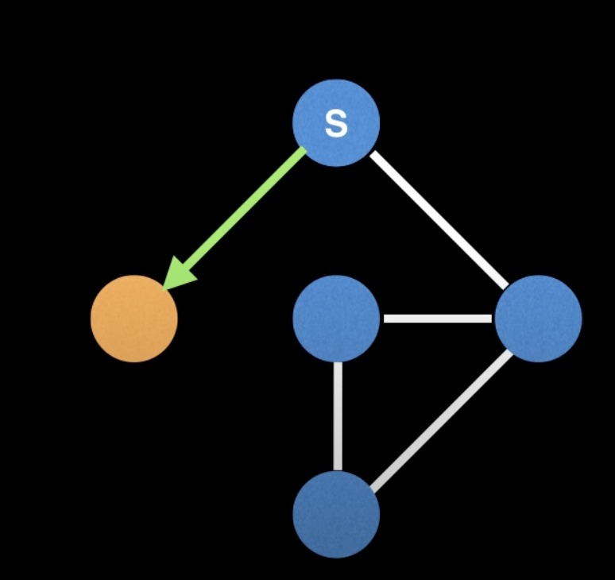

## Paths

A walk from one place to another is known as graph.
A path can touch many nodes and edges.

## Cycle/circuit

A path that starts and ends at the same node is known as a cycle/circuit

## Eulerian path

A path that visits all the edges exactly once.
Note: some nodes may be visited twice.

### Existence condition for eulerian path

**Eulerian path existence depends on start node `s`**
E.g. no eulerian path exists if we start at folowing start node:

## Eulerian circuit

A path that visits all the edges exactly once and ends up in same node.

## Hamiltonian path

A path that visits all nodes exactly once.
Note: some edges might remain unvisited in this process

## Hamiltonian circuit

Visits all nodes exactly once and path forms a cycle, i.e ends up in same node.

