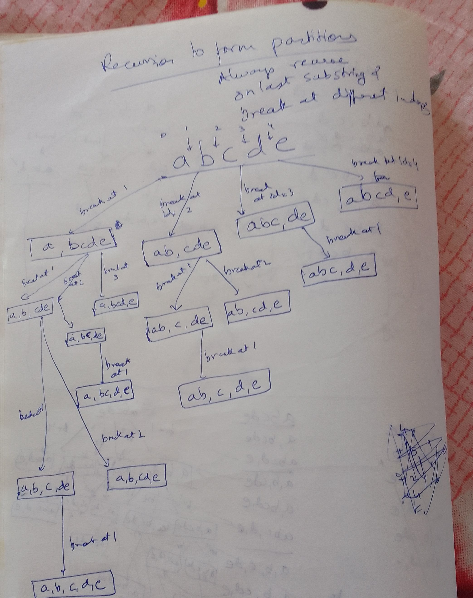

##

Also formulated as all possible sub-list/array partitions of a give array (non zero sized sublist/array)

https://www.geeksforgeeks.org/print-ways-break-string-bracket-form/

## Example

Input : abcd
Output : (a)(b)(c)(d)
         (a)(b)(cd)
         (a)(bc)(d)
         (a)(bcd)
         (ab)(c)(d)
         (ab)(cd)
         (abc)(d)
         (abcd)


## Recursion tree



## CODE TODO


```java
// "static void main" must be defined in a public class.
public class Main {
    public static void main(String[] args) {
        System.out.println("Hello World!");
        // print all possible non-empty partitions of a list
        // e.g. for [1,2,3]
        // [[1], [2,3]]
        // [[1,2],[3]]
        List<List<Integer>> ans = new ArrayList<>();
        List<Integer> list = new ArrayList<>();
        list.add(1);
        list.add(2);
        list.add(3);
        list.add(4);
        list.add(5);
        backtrack(ans, 0, list.size() - 1, list);
    }
    
    // end is inclusive of array items
    static void backtrack(List<List<Integer>> prevList, int start, int end, List<Integer> original) {
        
        ArrayList<Integer> thisList = new ArrayList<>();
        for(int i=start; i<=end;i++) {
             thisList.add(original.get(i));
        }

        // System.out.println("prevList = " + prevList +" thisList = "+thisList +" start = "+ start+" end = "+ end);
        List<List<Integer>> temp = new ArrayList<>();
        temp.addAll(prevList);
        temp.add(thisList);
        System.out.println("combined ans = " + temp);
                
        for(int m = start+1; m<=end;m++) {// for all possible first sub-array of given array, including end
            ArrayList<Integer> first = new ArrayList<Integer>();

            for(int i=start;i<m;i++) {// not including m
                first.add(original.get(i));
            }
            prevList.add(first);// add the first sub array, 
            backtrack(prevList, m,end, original);// recurse on the remaining
            prevList.remove(first);
        }
    }
}
```

