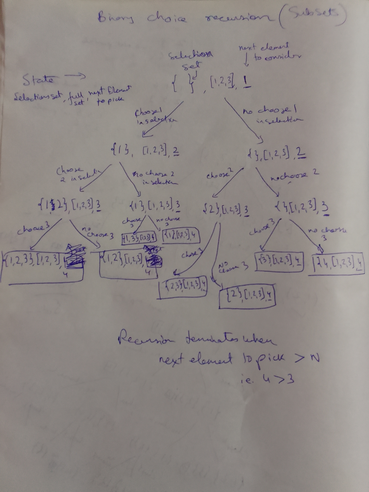

## Use binary choice recursion on all elements going from left to right

### Binary choice recursion tree



### Code for binary choice recursion

```java
public class Main {
    public static void main(String[] args) {
        System.out.println("Hello World!");
        List<Integer> list = new ArrayList<Integer>();
        list.add(1);
        list.add(2);
        list.add(3);
        list.add(4);
        List<Integer> state = new ArrayList<Integer>();
        printSubsets(state, list, 0);
    }
    
    public static void printSubsets(List<Integer> state, List<Integer> originalList, int itemUnderConsideration) {
        if(itemUnderConsideration == originalList.size()) {
            System.out.println("state = " + state);
            return;
        }
        
        // choose item under consideration in state
        Integer i = originalList.get(itemUnderConsideration);
        state.add(i);
        printSubsets(state, originalList, itemUnderConsideration + 1);
        state.remove(i);// backtrack
        
        // don't choose item underconsideration in state
        printSubsets(state, originalList, itemUnderConsideration + 1);
    }
}
```

## another technique is bit counting in integers for 1 << n for n element array

## For n elements, there are 2^n subsets, and each element appears in exactly 2^(n-1) of these subsets.

If we do a binary choice recursion tree, we have option to take an item or leave it, and it shows up accordingly

Or in other way to think about it, a given element fixed, there are $2^{n-1}$ possiblities on whether or not to choose other items.

