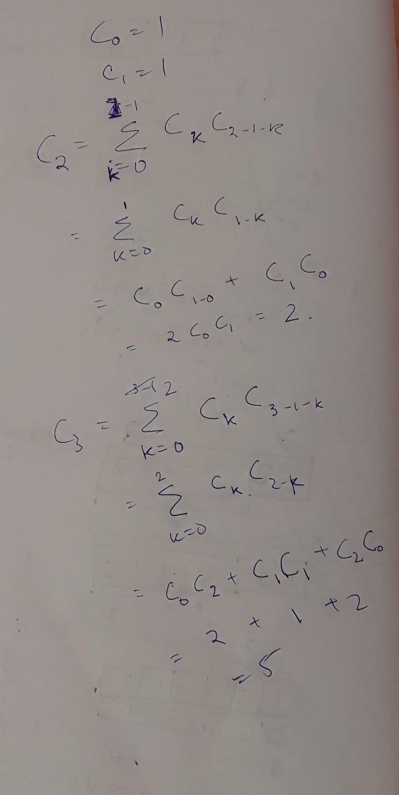

##

https://cp-algorithms.com/combinatorics/catalan-numbers.html

## A recursive sequence that shows up in many places like parenthesization, number of balanced BSTs etc

Also refer [Dp](../DynamicProgramming/CatalanNumbers.md) for DP like treatment of this recurrence

##

1, 2, 5, 14, ...

## REcurrence formula

$$ C_0 =  C_1 = 1$$

$$ C_{n+1} = \sum_{k=0}^{n} C_k * C_{n-k}, n+1 >= 2$$

## Calculation



## Code

```java
class Solution {
    public int numTrees(int n) {
        int[] cat = new int[n+1];
        
        cat[0] = 1;
        cat[1] = 1;
        
        for(int i=2;i<n+1;i++) {
            for(int k=0;k<=i-1;k++) {
                cat[i] += cat[k] * cat[i-1-k];
            }
        }
        // System.out.println(Arrays.toString(cat));
        return cat[n];
    }
}
```
